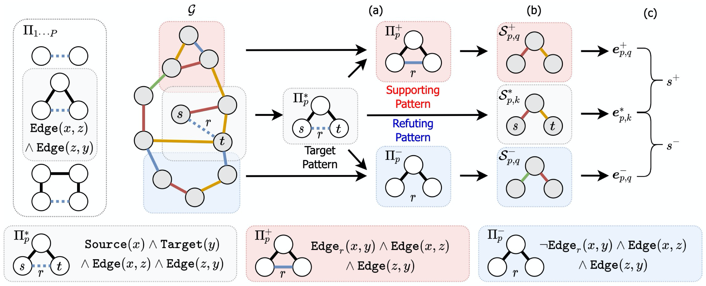

# ANalogy subGraph Embedding Learning (GraphANGEL)
Code for ICLR'22 "Inductive Relation Prediction Using Analogy Subgraph Embeddings"

<p align="center">
  
  <br />
  <br />
</p>


This includes  `pytorch` implementations of light and heavy (i.e., original) versions of GraphANGEL model. This is the experiment code in the following work:


> Inductive Relation Prediction Using Analogy Subgraph Embeddings </br>
> Jiarui Jin, Yangkun Wang, Kounianhua Du, Weinan Zhang, Quan Gan, Zheng Zhang, Yong Yu, David Wipf. </br>
> [ICLR 2022](https://openreview.net/pdf?id=PTRo58zPt3P)

We are working on developing a lighter and easier version of GraphANGEL in the [AwesomeStructure](https://github.com/Jinjiarui/AwesomeStructure) project.

### References

If you find this work helpful in your research, please consider citing the following paper. The bibtex are listed below:
```bibtex
@inproceedings{jin2021inductive,
  title={Inductive Relation Prediction Using Analogy Subgraph Embeddings},
  author={Jin, Jiarui and Wang, Yangkun and Du, Kounianhua and Zhang, Weinan and Zhang, Zheng and Wipf, David and Yu, Yong and Gan, Quan},
  booktitle={International Conference on Learning Representations},
  year={2021}
}
```
